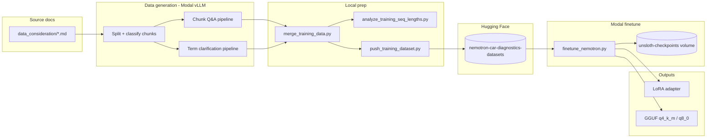

# Modal training guide — Nemotron car diagnostics SFT

End-to-end pipeline for this project: **generate training data from OBD docs → merge → push to Hugging Face → LoRA fine-tune on Modal → export LoRA + GGUF**.

Base model: [`unsloth/NVIDIA-Nemotron-3-Nano-4B`](https://huggingface.co/unsloth/NVIDIA-Nemotron-3-Nano-4B)

## Fine-tuned models (Hugging Face)

| Artifact | Hub |
|----------|-----|
| **LoRA adapter** | [build-small-hackathon/nemotron-car-diagnostics-lora](https://huggingface.co/build-small-hackathon/nemotron-car-diagnostics-lora) |
| **GGUF** (`q4_k_m`, `q8_0`) | [build-small-hackathon/nemotron-car-diagnostics-gguf](https://huggingface.co/build-small-hackathon/nemotron-car-diagnostics-gguf) |
| **Training dataset** | [build-small-hackathon/nemotron-car-diagnostics-datasets](https://huggingface.co/build-small-hackathon/nemotron-car-diagnostics-datasets) |

Load the LoRA on top of the base Nemotron 4B, or download GGUF for llama.cpp / Ollama.

## Pipeline overview



---

## Prerequisites

### Local environment

Conda env: **`small-hack-1`**

```powershell
conda activate small-hack-1
cd C:\Users\dsouz\small-hack
```

Repo-root **`.env`** (for local scripts):

```env
HF_TOKEN=hf_...
```

### Modal

- [Modal](https://modal.com) CLI installed and authenticated
- Modal secret **`huggingface-secret`** with `HF_TOKEN` (read private datasets + models; write if pushing models)

### Inference for data generation

Chunk/term Q&A generation calls a **Modal vLLM** endpoint. Deploy one of:

- `modal_files/nemotron-nano-vllm.py` — default profile `nemotron`
- `modal_files/gpt_oss_vllm.py` — profile `gpt-oss`

Profiles are defined in `modal_files/llm_profiles.py`.

---

## Part 1 — Data generation

Training examples are **not** hand-written. They are synthesized from automotive documentation in two passes.

### 1.1 Source material

| Path | Role |
|------|------|
| `data_consideration/*.md` | Raw OBD / Toyota hybrid / diagnostics docs |
| `data_consideration/questions_config.json` | Per-category question counts |
| `data_consideration/prompts/*.md` | System prompts (diagnostics, fundamentals, term clarification, verbose reasoning) |

### 1.2 Classify chunks

Split markdown into chunks and label each chunk (diagnostics, fundamentals, other, etc.).

```powershell
# On Modal (recommended)
modal run modal_files/classify_chunks.py

# Local (needs VLLM_BASE_URL)
python scripts/classify_chunks.py
```

**Output:** `classified_chunks/all_chunks.jsonl`

Each record has chunk text, source file, category, and metadata used downstream.

### 1.3 Chunk Q&A pipeline

Generates **shop-style questions** from each chunk, then a **second pass** for answer + reasoning.

| Step | What happens |
|------|----------------|
| Pass 1 | Structured LLM call → N questions per chunk (no answers yet) |
| Pass 2 | `reasoning_pass.py` → concise `answer` + first-person `reasoning` grounded in chunk |

```powershell
modal run modal_files/generate_questions.py
modal run modal_files/generate_questions.py --llm gpt-oss --limit 10
modal run modal_files/generate_questions.py --num-questions 5 --fresh
```

**Outputs:**

| Path | Contents |
|------|----------|
| `generated_qa/all_qa.jsonl` | All chunk Q&A (incremental, resumable) |
| `training_data/chunk_qa/{model-slug}.jsonl` | Per-teacher-model training rows |

Implementation: `modal_files/qa_generator.py`

### 1.4 Term clarification pipeline

Identifies confusing terms in each chunk and builds clarification Q&A (same two-pass pattern).

```powershell
modal run modal_files/generate_term_questions.py
modal run modal_files/generate_term_questions.py --llm gpt-oss --limit 10 --fresh
```

**Outputs:**

| Path | Contents |
|------|----------|
| `generated_term_qa/all_term_qa.jsonl` | All term Q&A |
| `training_data/term_clarification/{model-slug}.jsonl` | Per-teacher-model rows |

Implementation: `modal_files/term_qa_generator.py`

### 1.5 Training record shape (flat JSONL)

Each line is one example:

```json
{
  "id": "deep-research-report-diagnostics.md:42:nemotron:3",
  "example_type": "chunk_qa",
  "question": "What does a positive long-term fuel trim indicate?",
  "answer": "Sustained positive LTFT means the ECU is adding fuel...",
  "reasoning": "I'd start with the fuel trim sign convention..."
}
```

Required fields for SFT: **`question`**, **`answer`**, **`reasoning`**.

### 1.6 Nemotron message format

At **Hub push** time, `modal_files/training_format.py` builds the `messages` column:

| Role | Content |
|------|---------|
| **user** | `question` only (no chunk context at inference) |
| **assistant** | `<think>{reasoning}</think>{answer}` |

Tokenization uses `enable_thinking=False` — thinking tags are already in the label; do not enable Nemotron native thinking mode during SFT.

**Merge does not rewrite `messages`** — it concatenates source JSONL as-is. Formatting happens in `push_training_dataset.py`.

---

## Training dataset

**Hub:** [build-small-hackathon/nemotron-car-diagnostics-datasets](https://huggingface.co/build-small-hackathon/nemotron-car-diagnostics-datasets)

The dataset is **synthetic SFT data** for car diagnostics: shop-style questions, short answers, and verbose first-person **reasoning** traces. It is built from classified OBD/Toyota hybrid documentation — not from live scan logs.

### Scale and mix

| | Count | Share |
|---|------:|------:|
| **Total examples** | **15,048** | 100% |
| Term clarification (`term_clarification`) | 9,678 | **64%** |
| Chunk Q&A (`chunk_qa`) | 5,370 | **36%** |

Both example types are generated **twice** (two teacher LLMs on Modal vLLM), then merged with dedupe on `id`:

| Pipeline | `gpt-oss-120b` | `nvidia-nemotron-3-nano-30b-a3b-bf16` | Subtotal |
|----------|---------------:|---------------------------------------:|---------:|
| Chunk Q&A | 2,695 | 2,675 | 5,370 |
| Term clarification | 4,960 | 4,718 | 9,678 |

### Source documentation (top topics)

Examples are grounded in chunks from project markdown under `data_consideration/`:

| Source file | ~Examples |
|-------------|----------:|
| `deep-research-report-diagnostics.md` | 4,725 |
| `deep-research-report-fault-reference.md` | 3,140 |
| `deep-research-report-fault-signatures.md` | 2,300 |
| `fault_profiles.md` | 2,180 |
| `toyota_dtc_definitions.md` | 1,165 |
| PID / fundamentals docs | ~1,000 |

Question counts per chunk vary by category and source (`data_consideration/questions_config.json`) — e.g. more questions from fault-signature and fault-reference docs.

### Two example types

**1. Chunk Q&A (`chunk_qa`)** — diagnostic questions answerable from a doc chunk.

- Pass 1: generate N shop-floor questions (PIDs, DTCs, symptoms, troubleshooting).
- Pass 2: `verbose_reasoning.md` → concise **answer** + first-person **reasoning** using chunk context privately.
- User message at training time: **question only** (no chunk text).

Example focus: *“When STFT stays above +10% with normal MAF, what should you check first?”*

**2. Term clarification (`term_clarification`)** — vocabulary and concept clarity.

- Pass 1: pick confusing automotive terms (PIDs, DTCs, acronyms, OBD concepts) and learner-style questions.
- Pass 2: same reasoning pass → answer + monologue explaining the term in diagnostic terms.
- Records include a `term` field; user message is still **question only**.

Example focus: *“What does ‘fuel trim’ mean when I’m looking at live data?”*

### Why reasoning is in the dataset

Nemotron 3 is trained for **thinking-style** outputs (`<think>…</think>`). This project fine-tunes that behavior for **automotive diagnostics**:

1. **Teach process, not just facts** — Reasoning is a first-person diagnostic monologue (“I’d check…”, “If STFT is high, I’d suspect…”). The model learns *how* to work through a problem, not only the final line.
2. **Match deployment format** — At inference the user sends a question; the model should emit thinking then a concise answer. SFT labels mirror that: assistant content is `thinking + answer`.
3. **Chunk context is hidden at inference** — Teachers use chunk text to ensure accuracy, but reasoning must **not** cite “the chunk” or “the context” (`verbose_reasoning.md`). That trains standalone shop-floor thinking from a bare question.
4. **Assistant-only loss** — `train_on_responses_only` masks the user turn; the model is not trained to predict the question, only the reasoning + answer. That concentrates capacity on generation quality and reasoning style.

Token stats on the merged corpus (Nemotron tokenizer): **p50 ~300**, **p99 ~650**, **max ~6,200** tokens — `max_seq_length=8192` fits all examples without truncation.

### Hub row schema

Each row pushed to Hugging Face includes:

| Column | Description |
|--------|-------------|
| `id` | Stable key (`source:chunk:teacher:index`) |
| `example_type` | `chunk_qa` or `term_clarification` |
| `question`, `answer`, `reasoning` | Flat fields |
| `messages` | `[{user: question}, {assistant: <think>reasoning</think>answer}]` |

---

## Part 2 — Merge and publish dataset

### 2.1 Merge training JSONL

```powershell
python scripts/merge_training_data.py
python scripts/merge_training_data.py --models nvidia-nemotron-3-nano-30b-a3b-bf16
python scripts/merge_training_data.py --types chunk_qa
python scripts/merge_training_data.py --no-dedupe
```

| Flag | Default |
|------|---------|
| `--training-dir` | `training_data/` |
| `--output` | `training_data/all_merged.jsonl` |
| `--types` | `chunk_qa` + `term_clarification` |
| `--models` | all (optional substring filter on filename) |

See [Training dataset](#training-dataset) for counts, mix, and reasoning rationale. Merged file: **15,048** examples (deduped by `id`).

### 2.2 Analyze sequence lengths (optional)

```powershell
python scripts/analyze_training_seq_lengths.py
```

Typical stats on current data: p50 ~300 tokens, p99 ~650, max ~6200. Default **`max_seq_length=8192`** gives zero truncation.

### 2.3 Push to Hugging Face Datasets

```powershell
python scripts/push_training_dataset.py
python scripts/push_training_dataset.py --public
```

| Default repo | `build-small-hackathon/nemotron-car-diagnostics-datasets` |
|--------------|--------------------------------------------------------|

Upload rows include a `messages` column ready for SFT.

---

## Part 3 — Fine-tune on Modal

Script: `modal_files/finetune_nemotron.py`

| Setting | Value |
|---------|-------|
| GPU | L40S |
| LoRA | r=16, alpha=32 |
| `max_seq_length` | 8192 |
| Epochs | 2 (default) |
| Eval | 90/10 split, best checkpoint by `eval_loss` |
| Loss | Assistant-only (`train_on_responses_only`) |

### Smoke test

```powershell
modal run modal_files/finetune_nemotron.py --max-steps 1 --skip-eval --no-gguf
```

### Full training run

```powershell
modal run modal_files/finetune_nemotron.py `
  --experiment-name nemotron-car-dx-v1 `
  --num-train-epochs 2
```

### Training + push LoRA and GGUF to Hub

```powershell
modal run modal_files/finetune_nemotron.py `
  --experiment-name nemotron-car-dx-v1 `
  --num-train-epochs 2 `
  --push-all-hub
```

| Artifact | Default Hub repo |
|----------|------------------|
| LoRA adapter | [build-small-hackathon/nemotron-car-diagnostics-lora](https://huggingface.co/build-small-hackathon/nemotron-car-diagnostics-lora) |
| GGUF `q4_k_m` + `q8_0` | [build-small-hackathon/nemotron-car-diagnostics-gguf](https://huggingface.co/build-small-hackathon/nemotron-car-diagnostics-gguf) |

### Useful flags

| Flag | Notes |
|------|-------|
| `--dataset-repo` | Default: `build-small-hackathon/nemotron-car-diagnostics-datasets` |
| `--experiment-name` | Fixed name enables resume |
| `--no-gguf` | Skip GGUF export |
| `--gguf-quantizations` | Default: `q4_k_m,q8_0` |
| `--push-hub` | LoRA only |
| `--push-gguf-hub` | GGUF only |

### Resume

Re-run with the same `--experiment-name`. Resumes from the latest `checkpoint-*` that has `trainer_state.json`.

### Data shuffling

- Hub JSONL order: file merge order (not shuffled at merge)
- Train/eval split: shuffled once with `seed=42`, cached on Modal volume
- Training: shuffled each epoch by `Trainer` (default)

---

## Part 4 — Export without retraining

If training finished but GGUF/Hub push failed:

```powershell
modal run modal_files/finetune_nemotron.py::export `
  --experiment-name nemotron-car-dx-v1 `
  --push-all-hub
```

Loads `best_model/` from the volume, pushes LoRA + exports GGUF.

---

## Part 5 — Download artifacts

### List volume contents

```powershell
modal volume ls unsloth-checkpoints experiments/
modal volume ls unsloth-checkpoints experiments/nemotron-car-dx-v1/best_model
modal volume ls unsloth-checkpoints experiments/nemotron-car-dx-v1/gguf
```

Directory sizes in `modal volume ls` are **not** file sizes — list inside `best_model/` and confirm `adapter_model.safetensors` exists (~50–200 MB).

### Download

```powershell
# LoRA adapter (needs base model at inference)
modal volume get unsloth-checkpoints `
  experiments/nemotron-car-dx-v1/best_model `
  .\nemotron-car-dx-lora

# GGUF (standalone merged + quantized)
modal volume get unsloth-checkpoints `
  experiments/nemotron-car-dx-v1/gguf `
  .\nemotron-gguf
```

Expect `nemotron-car-dx-v1/*.gguf` files (e.g. `*Q4_K_M.gguf` and `*Q8_0.gguf`) after a successful export.

### From Hugging Face

- LoRA: https://huggingface.co/build-small-hackathon/nemotron-car-diagnostics-lora  
- GGUF: https://huggingface.co/build-small-hackathon/nemotron-car-diagnostics-gguf  

```powershell
huggingface-cli download build-small-hackathon/nemotron-car-diagnostics-lora --local-dir .\nemotron-lora
huggingface-cli download build-small-hackathon/nemotron-car-diagnostics-gguf --local-dir .\nemotron-gguf
```

---

## Artifacts explained

| Artifact | Fused? | Use case |
|----------|--------|----------|
| **`best_model/`** (LoRA) | No — adapter only | Load on top of base Nemotron 4B; smallest; best for further training |
| **GGUF `q4_k_m` / `q8_0`** | Yes — LoRA merged into base, then quantized | llama.cpp, Ollama; single file; some precision loss |

GGUF export uses **one** `save_pretrained_gguf` call with `quantization_method=["q4_k_m","q8_0"]` (merge once, then both quants). Output folder: `gguf/{experiment-name}/` with `*.gguf` files inside.

To re-export only `q8_0`:

```powershell
modal run modal_files/finetune_nemotron.py::export `
  --experiment-name nemotron-car-dx-v1 `
  --gguf-quantizations q8_0
```

---

## Modal volumes

| Volume | Mount | Contents |
|--------|-------|----------|
| `huggingface-cache` | `/model_cache` | HF model weights cache |
| `unsloth-dataset-cache` | `/dataset_cache` | Preprocessed train/eval splits |
| `unsloth-checkpoints` | `/checkpoints` | `experiments/{name}/best_model`, `gguf/`, `checkpoint-*` |

Checkpoint path on volume:

```
experiments/{experiment-name}/
  best_model/          # LoRA adapter + tokenizer
  gguf/                # merged quantized models
  checkpoint-*/        # mid-training (resume)
```

---

## Key files

| File | Role |
|------|------|
| `modal_files/classify_chunks.py` | Split + classify source markdown |
| `modal_files/generate_questions.py` | Chunk Q&A generation (Modal) |
| `modal_files/generate_term_questions.py` | Term clarification (Modal) |
| `modal_files/qa_generator.py` | Chunk Q&A core logic |
| `modal_files/term_qa_generator.py` | Term Q&A core logic |
| `modal_files/reasoning_pass.py` | Shared answer + reasoning pass |
| `modal_files/training_format.py` | Nemotron `messages` formatting |
| `scripts/merge_training_data.py` | Merge JSONL → `all_merged.jsonl` |
| `scripts/push_training_dataset.py` | Push dataset to Hub |
| `scripts/analyze_training_seq_lengths.py` | Token length stats |
| `modal_files/finetune_nemotron.py` | Modal Unsloth LoRA training + GGUF export |

---

## Quick command checklist

```powershell
# 1. Generate data (Modal)
modal run modal_files/classify_chunks.py
modal run modal_files/generate_questions.py --llm nemotron
modal run modal_files/generate_term_questions.py --llm nemotron

# 2. Merge + push
python scripts/merge_training_data.py
python scripts/push_training_dataset.py

# 3. Train
modal run modal_files/finetune_nemotron.py `
  --experiment-name nemotron-car-dx-v1 `
  --num-train-epochs 2 `
  --push-all-hub

# 4. Or export only (if train already done)
modal run modal_files/finetune_nemotron.py::export `
  --experiment-name nemotron-car-dx-v1 `
  --push-all-hub

# 5. Download
modal volume get unsloth-checkpoints experiments/nemotron-car-dx-v1/best_model .\nemotron-lora
modal volume get unsloth-checkpoints experiments/nemotron-car-dx-v1/gguf .\nemotron-gguf
```
