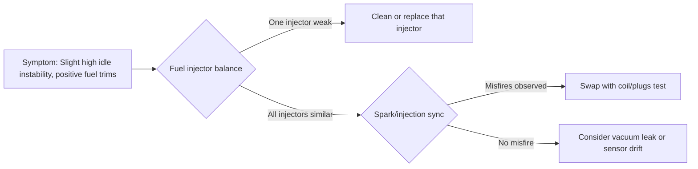
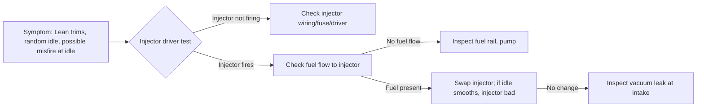
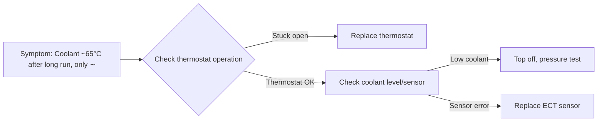
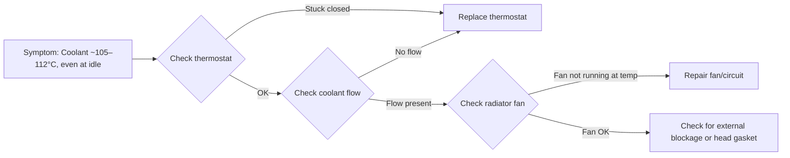
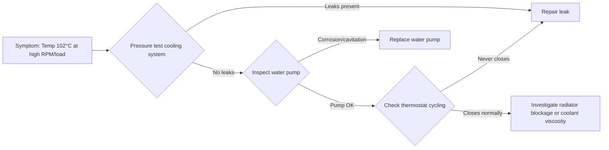

# Automotive Maintenance Basics: PID Definitions and Diagnostics

Modern vehicles use an array of sensors and OBD-II **PIDs** (Parameter IDs) to monitor engine performance. This report defines key engine parameters (STFT/LTFT, MAF, MAP, TPS, O₂ sensors, etc.), their normal ranges and failure modes, and explains how mechanics interpret them. We then apply these concepts to diagnose each of 31 common faults (e.g. vacuum leak, dirty MAF, fuel pump weak, ignition coil failure, thermostat stuck, etc.) using live data and targeted tests. Each fault profile includes an executive summary, a diagnostic flowchart (Mermaid), and practical test tips. Tables compare the faults by affected PIDs, typical DTCs and suggested order of checks. Safety notes and recommended tools (smoke machine, vacuum gauges, fuel pressure tester, etc.) are included where relevant.

## Key Engine Parameters and PIDs

- **Engine Coolant Temp (ECT)** – A 2-wire **thermistor** immersed in the engine coolant. Resistance *drops* as coolant heats. At ~20°C the ECU sees ~2.0–3.0 V, while at ~90°C it falls to ~0.5–1.0 V. Normal warm temp is ~85–100°C; if ECT stays low (<60°C) the ECU will “think” the engine is cold and enrich fuel (rich trim). A stuck-open thermostat will cause ECT to stay abnormally low (~65°C even when warmed) (diagnose by slow warm-up). If ECT reads an impossible value (e.g. –40°C or constant 5 V), suspect a failed sensor or open circuit. Mechanics often test ECT with an ohmmeter (resistance should match temp) or measure voltage while warming (voltage should drop as coolant heats).  

- **Intake Air Temp (IAT)** – A **thermistor** (usually inside the MAF housing or intake) that measures incoming air temperature. Cooler air is denser, so the ECU uses IAT to correct fuel calculation. Typical IAT readings are ambient (~20–25°C = ~3.0 V) at key-on/cold and rise as engine bay heat warms the sensor. A reading stuck near –40°C (0V or 255 code) means an open circuit. Mechanics verify by checking that IAT tracks ambient/engine temperatures or by measuring its resistance vs. temp (NTC sensors have ~2–3 V at 20°C, dropping toward 0.5 V as intake warms).  

- **Mass Air Flow (MAF) Sensor** – Measures the *mass* of intake air (usually in grams/sec). The most common type is a hot-wire sensor placed after the air filter. It outputs a voltage or frequency proportional to airflow. The ECU uses MAF to calculate fuel injection. Typical values depend on engine size and RPM: for example, idle airflow might be a few g/s per liter of displacement, rising to tens of g/s at wide-open throttle. (Technicians often note “engine liters ≈ idle g/s” as a rule of thumb, though it can vary.) A healthy MAF shows fuel trims near 0; if fuel trims exceed ~+10%, suspect misreporting or leaks. Mechanics test it by comparing live MAF readings to known-good specs or performing a volumetric efficiency (VE) test. A common quick check is to clean the MAF with sensor cleaner. Also check for air filter blockage or intake leaks, since any restriction alters MAF output.  

- **Manifold Absolute Pressure (MAP)** – Measures intake manifold pressure (absolute vacuum) via a diaphragm sensor. The ECU uses MAP (often in kPa or inHg) together with RPM to infer engine load. At idle, MAP ~20–30 inHg (vacuum), rising toward ~29.9 inHg (sea-level) at full throttle. Mechanics verify MAP by checking that it reads near atmospheric (baro) with ignition on, engine off, and drops to ~10–20 inHg at idle. A mismatched MAP (e.g. high vacuum at high RPM) can indicate leaks or sensor fault. The ECU may use MAP for fuel calculation on MAP-based systems.  

- **Calculated Engine Load** – A computed PID indicating how “hard” the engine is working (often expressed as a percent of peak load). By SAE definition, it reaches 100% at wide-open throttle regardless of RPM or altitude. On a naturally aspirated engine, idle load might read ~30–50% (in one test ~17% on a VW Passat at 878 RPM). In short, load rises as throttle opens and manifold vacuum falls. Mechanics glance at load vs. RPM: if load stays low despite high throttle, suspect intake/exhaust restriction.  

- **Throttle Position (TPS)** – A potentiometer on the throttle plate shaft that outputs a voltage (or %). It indicates throttle opening from closed (~0–10% or ~0.5–1 V) to wide open (usually ~90–100% or ~4.5–5 V). The TPS tells the ECU driver demand. Common failure modes: erratic readings, jumpiness, or “stuck” values. Mechanics test it by comparing voltage or % to throttle angle: idle should be steady near 5–12% (depending on calibration), full throttle ~90%. Codes P0122–P0124 are triggered by TPS anomalies.  

- **Engine RPM (Eng RPM)** – Revolutions per minute of the crankshaft. Measured by crank or camshaft position sensors, this is used by the ECU for timing, fueling and diagnostics. It should rise smoothly with throttle; random fluctuations/misfires will show as rapid RPM swings (especially at idle).  

- **Vehicle Speed (Veh Speed)** – Output from a transmission or wheel speed sensor. Displayed in km/h or mph. It mainly affects shift points and some idle control; not always critical in diagnosis of engine drivability but is a useful scan tool parameter.  

- **Oxygen Sensors (O₂)** – Zirconia “narrowband” or wideband O₂ sensors sense oxygen in exhaust, generating a voltage (narrowband: 0–1 V) or a ratio/λ signal (wideband). *Bank1 Sensor1 (B1S1)* is the upstream sensor (pre-catalyst) for bank 1 cylinders; *Bank1 Sensor2 (B1S2)* is downstream (post-cat). In closed-loop, a healthy upstream O₂ should swing rapidly between ~0.1 V (lean) and ~0.9 V (rich) around 0.45 V. A smooth oscillation indicates active fuel correction. Downstream O₂ (post-cat) should be much steadier around ~0.4–0.6 V if the cat is good. If *both* sensors oscillate, it suggests a failed catalytic converter. A stuck or erratic O₂ (flat at 0 V or pegged high) indicates a bad sensor. Mechanics use O₂ readings to gauge air-fuel and cat health: rapid swings (B1S1) mean closed-loop is active; a downstream voltage that never changes (or follows the upstream) indicates conversion failure.  

- **Fuel Trims (STFT & LTFT)** – These PIDs show how the ECU is adjusting fuel to maintain stoichiometry. **STFT (Short-Term Fuel Trim)** is the instantaneous correction, **LTFT (Long-Term Fuel Trim)** is the learned adjustment over time. Both are shown as percent. Positive means adding fuel (lean condition), negative means reducing fuel (rich condition). Normally they stay within about ±5%. Values beyond ±10% flag trouble. For example, STFT ~+15–20% means the ECU is adding fuel to compensate for a lean mixture. Mechanics always check trims in multiple conditions: if fuel trims are high only at idle, suspect a vacuum leak; if high at all loads, suspect fuel delivery issues.  

- **Exhaust Gas Recirculation (EGR) Commanded** – Percent that the ECU is commanding the EGR valve to open (0% = closed, 100% = fully open). A stuck-open EGR (command 100% at idle) will cause rough idle and lean trim. The “Command EGR” PID does not measure flow—only what the computer is telling the valve. When parked, Command EGR should read 0% for a healthy system.  

- **Evaporative Purge (EVAP Purge) Command** – Similar to EGR, this PID shows the duty (0–100%) of the purge solenoid that vents fuel vapors into the intake. 0% = OFF (closed), 100% = ON (open). At idle, purge should normally be off (0%); an EVAP purge stuck on will dump extra fuel vapor, causing rich or lean idle conditions.  

- **Catalyst Temperature** – Many modern systems (especially diesels or high-end cars) have exhaust gas temperature (EGT) sensors before/after the catalytic converter. High catalyst temperature can indicate heavy load or cat restriction. (For example, measuring inlet vs. outlet temp can diagnose a plugged converter.) Typical safe exhaust temps are a few hundred °C; glowing red-black exhaust parts (>750°C) signal problems.  

- **Control Module Voltage** – The system voltage (battery/alternator). Normal running voltage is typically ~13.5–14.5 V. A reading ~12.5 V or lower running indicates a weak alternator/battery; >15 V indicates overcharging. Voltage under ~11 V or above ~16 V can throw codes (P0562 low, P0563 high). Mechanics always check voltage early, since low voltage can cause spurious sensor readings.  

- **Ignition Timing (Spark Advance)** – The crankshaft degrees at which spark fires before top dead center (TDC). Reported in degrees (e.g. 10° BTDC). Timing is advanced for load/speed demands and retarded when needed. (In scan data this may appear as “Spark Adv” or timing advance.) Very low advance under light load or erratic values can indicate timing chain/belt issues or sensor faults.  

- **Engine Compression** – Not a PID but a measure of mechanical health. Low compression in one cylinder (due to leaks, worn rings, valve issues) causes misfires and lean trim on that cylinder’s bank. Mechanics verify by compression or leak-down tests.  

In summary, these PIDs form the “alphabet” of the OBD data stream. A mechanic uses live PIDs (via scan tool) plus physical tests to pinpoint issues. For instance, simultaneous high positive STFT/LTFT and low MAF often mean unmetered air (vacuum leak), whereas high fuel trims at all loads suggest fuel delivery problems. Below we apply these principles to diagnose specific faults.

## Fault Comparison Tables

| Fault                       | Primary PIDs Affected                     | Typical DTCs          | Quick Check Priority (fastest to rule out) |
|-----------------------------|-------------------------------------------|-----------------------|-------------------------------------------|
| **Air System:**             |                                           |                       |                                           |
| vacuum_leak                 | STFT↑, LTFT↑, MAF↓, Intake Pressure low, RPM↑ | P0171 (lean B1)       | 1) Visual leaks (hoses, PCV)  2) Smoke test or soapy water  3) Check MAF, IAC<br>4) Fuel trims at idle vs wot |
| dirty_maf                   | MAF↓ (for load), STFT↑, LTFT↑             | P0171 (lean)          | 1) Inspect/clean MAF  2) Check air filter  3) Compare MAF g/s vs RPM (see spec)  4) Fuel trims under load |
| air_filter_restriction      | Throttle↑, MAF↓ (for given RPM), Engine Load↓ | — (lean clues)      | 1) Inspect/replace air filter  2) Smoke test upstream intake  3) Road test trims/wot  4) Fuel trims vs throttle |
| egr_stuck_open              | RPM fluctuating at idle, Commanded EGR 100% | P0400-P0405 (EGR codes) | 1) Scan: Commanded EGR at idle  2) Inspect EGR valve mechanically (stuck open)  3) Bypass or vacuum test EGR  4) Check idle quality |
| **Fuel System:**            |                                           |                       |                                           |
| fuel_pump_weak_load         | STFT↑, LTFT↑ (only under load)             | P0171, P0174 (lean)   | 1) Fuel pressure gauge at idle vs WOT (should hold spec ~40–60 psi)  2) Check fuel pump current draw  3) Inspect fuel filter  4) Observe fuel trims under heavy load |
| dirty_injectors             | STFT↑, LTFT↑, possible slight RPM drop     | P0171 (lean)         | 1) Fuel injector balance test or cleaning  2) Fuel pressure (should hold pressure without drop)  3) Injector spray pattern  4) Check ignition coils (to isolate lean spark vs fuel issues) |
| injector_leak              | STFT↓, LTFT↓ (rich trim), rough idle        | P0172 (rich)         | 1) Check fuel rail pressure decay (should not continue rising)  2) Smell for fuel, check spark plug fouling  3) Cylinder drop-out test (remove injector connector)  4) Backpressure on intake with throttle closed |
| injector_stuck_closed      | STFT↑, LTFT↑, RPM ripple at idle          | P0171, P030X (misfire) | 1) Observe misfire on specific cylinder  2) Swap injector with another bank to see if misfire moves  3) Compression test (to rule out mech)  4) Inspect injector resistance/operation |
| **Ignition:**               |                                           |                       |                                           |
| ignition_coil_failure      | RPM random (idle), O₂ oscillating, STFT↑   | P030X (misfire)      | 1) Swap coil with another cylinder to see if misfire moves  2) Check coil primary/secondary with multimeter or scope  3) Inspect coil boots/plugs  4) Observe scan data: O₂ sensor swings from misfires |
| spark_plug_wear           | Gradual rise in LTFT (lean), MPG drop      | P030X (misfire)      | 1) Inspect plugs (gap, electrodes)  2) Replace plugs if high mileage (>80k)  3) Check fuel trims after plug change  4) Check ignition timing and coil operation |
| **Cooling:**                |                                           |                       |                                           |
| thermostat_stuck_open     | Coolant ~60–70°C even long-run (low ECT)   | P0128 (cold)         | 1) Check coolant temperature vs ambient (should reach ~85–100°C)  2) Test thermostat in pot of water or replace to verify  3) Bypass thermostat to confirm temp rise  4) Fuel trim/rich strategies (cold even when engine has run) |
| thermostat_stuck_closed   | Coolant 105–112°C (high even at idle)      | P0128 (overheat), P0217 | 1) Observe ECT high, fan on constant or won’t engage  2) Check thermostat operation (remove or test)  3) Check radiator flow (overheat at idle, normal at speed)  4) Inspect for head gasket (if random temp swings) |
| cooling_fan_failure_idle  | Coolant ~108°C at idle, drops when moving  | P0128 (overheat idle) | 1) Run engine to temp and see if fan kicks on at high temp (using scan or gauge)  2) If fan fails, test fan motor and relay  3) Verify fan control temp sensor  4) Radiator drain (if hot coolant) safely |
| water_pump_degradation    | Coolant rising under heavy load (e.g. 102°C at high RPM) | —           | 1) Pressure test cooling system (no external leaks)  2) Observe coolant temp vs rpm (should not rise at idle)  3) Check for bearing play, shaft wobble  4) Consider pump replacement if corrosion or impeller worn |
| low_coolant               | Coolant temp erratic (77–110°C), poor heat  | —                   | 1) Check coolant level in reservoir  2) Pressure-test cooling system for leaks  3) Fill and burp system, retest  4) Watch for mix of hot/cold fuel trims (e.g. overrich when perceived cold) |
| **Emissions:**              |                                           |                       |                                           |
| catalyst_degradation      | O₂ B1S2 swings random, O₂ B1S1 wide (WR)   | P0420 (cat eff.)     | 1) Use scan: if downstream O₂ rapidly swings like upstream, cat is bad  2) Measure backpressure or exhaust vacuum test  3) IR thermometer: inlet vs outlet ~100°F difference expected  4) Inspect/dismantle cat for blockage or meltdown |
| catalyst_restriction      | High engine load, low MAF (like choking), Cat temp ↑ | P0420, P0421    | 1) Vacuum gauge test: vacuum drops continuously under rev  2) Check exhaust backpressure at manifold  3) Temperature test: outlet much hotter than inlet  4) If clogged, usually replace catalytic converter |
| evap_purge_stuck          | Purge=100%, idle trims lean (STFT+14%)     | P0446 (EVAP purge valve) | 1) Scan: EVAP purge commanded on at idle (should be 0%)  2) Visually inspect purge solenoid and hoses (replace if stuck open)  3) Smoke-test EVAP line (leaks also trigger P045X)  4) Disconnect canister purge solenoid to see if idle stabilizes |
| **Sensors:**                |                                           |                       |                                           |
| o2_sensor_drift          | LTFT gradually rises, O₂ B1S2 flat near mid | P0136/P0137 (slow response) | 1) Swap O₂ sensors (upstream/downstream) to isolate failing sensor  2) Check heater circuit (for wideband types)  3) Test with propane enrichment: sensor should go rich quickly  4) Monitor response time on scope |
| o2_sensor_failure_low    | O₂ B1S2 stuck ~0 V (lean)                 | P0136 (low voltage)  | 1) Measure the sensor voltage: if ~0 V regardless of condition, likely open-circuited  2) Check heater fuse (for heated O₂)  3) Replace sensor, confirm downstream.  4) Verify upstream O₂ still oscillates normally |
| o2_sensor_failure_high   | O₂ B1S2 stuck ~0.9 V (rich)               | P0137 (high voltage) | 1) Same as above: stuck high indicates short to heater or stuck rich sensor  2) Confirm with meter, replace sensor if needed  3) Check for exhaust leaks downstream (rare cause)  4) Monitor fuel trims (should go lean if sensor removed) |
| iat_sensor_failure_cold  | Intake Temp = –40°C (0x00)               | P0113 (high input)    | 1) Key On: IAT should read ambient. If it reads –40°C, likely open circuit (bad sensor or wiring)  2) Unplug IAT, measure resistance at room temp (typically ~2–3kΩ)  3) Replace sensor or repair wiring, clear code  4) Confirm IAT rises with warm air |
| ect_sensor_failure       | Coolant Temp = –40°C, STFT rich (–10%)    | P0117 (low input)     | 1) Similar to IAT: if ECT reads –40°C, suspect open  2) Measure ECT resistance at known temps or test in ice water (should be high resistance ~5–6kΩ at 0°C, decreasing to ~270Ω at 90°C)  3) If open or out-of-spec, replace sensor  4) Verify ECT then follows normal warm-up |
| map_sensor_failure       | RPM ~3000, Throttle ~44%, Intake Pressure idle-like | P0106 (MAP implausible) | 1) Unplug MAP: engine should run extremely poorly; if it still idles fine, suspect stuck MAP  2) Compare MAP vs baro: at key-on, engine-off, they should nearly match  3) Use hand pump: apply vacuum and see if MAP voltage changes smoothly  4) Replace sensor if stuck at one value |
| tps_failure             | TPS ~fixed (~12%), RPM varies 900–2500    | P0122/P0123 (TPS low/high) | 1) Observe TPS PID: if it never moves, throttle sensor is dead.  2) Check throttle plate: does engine rev without TPS change? (as in fault)  3) Backprobe TPS connector: should see ~0.5 V at closed throttle, rising to ~4.5 V at WOT  4) Replace TPS or throttle body if needed |
| **Electrical:**             |                                           |                       |                                           |
| alternator_failure       | Module Voltage ~12.7 V at idle           | P0562 (voltage low)   | 1) Measure battery voltage at idle: <13 V indicates bad charging  2) Rev engine: voltage should rise above 13.8 V.  3) Check alternator drive belt, connections  4) Test alternator output current or bench-test alternator |
| voltage_regulator_failure | Module Voltage ~15.8 V at idle         | P0563 (voltage high)  | 1) Same as above: >15.0 V indicates overcharging  2) Confirm with load test (lights on)  3) Inspect ground wires/regulator  4) Replace alternator/regulator if overvoltage persists |
| **Mechanical:**             |                                           |                       |                                           |
| compression_loss         | RPM random 700–1300, Throttle ~75%, MAF 22 g/s | P0171 (lean), P030X  | 1) Perform compression test on all cylinders (low compression on affected cylinders indicates leak).  2) Use cylinder balance: disable injectors one by one to find weak one  3) Inspect for vac leaks (head gasket, intake gasket)  4) If mechanical, likely repair by engine rebuild or gasket replacement |
| head_gasket_leak         | Coolant random 95–115°C, RPM random 650–1200, STFT+8% | P030X (misfire), P0128 (overheat) | 1) Pressure-test cooling system (see if combustion gases enter coolant)  2) Check oil/fuel for coolant contamination (milky oil)  3) Perform compression test (look for one cylinder low or block balance short-out)  4) Verify with block tester (CO₂ in rad) or inspect for white smoke |
| timing_chain_stretch     | Timing advance low, LTFT+7%, RPM 2400, speed ~55km/h | P0016 (cam/crank corr) | 1) Scope crank and cam signals: confirm cam arrives later than expected (lost tooth/chain stretch).  2) Many cars store P0016–P0018 codes.  3) If PCM-controlled VVT, lock timing (as test) and see if behavior normalizes.  4) Likely repair is chain replacement/timing adjustment |
| **Drivetrain:**             |                                           |                       |                                           |
| transmission_slip        | RPM ~4200, Speed ~25km/h, Engine Load ~56%  | —                     | 1) Check transmission fluid level/condition  2) Perform stall test (watch RPM at stall vs spec)  3) Road test: does dropping to lower gear eliminate slip?  4) Check for tranny codes or pressure loss; may require rebuild or solenoid repair |

*(DTC: Diagnostic Trouble Code. “Priority” lists the logical order of tests – e.g. quick visual/scan checks first, then deeper tests.)*

## Diagnostic Flowcharts

Below are mermaid flowcharts for each fault, illustrating the diagnostic approach from symptoms to fix. (Symbols: `[A]` = data/symptom, `{B}` = decision, `-->` = step).

### Air System Faults

```mermaid
flowchart LR
  AL1[Symptom: High idle RPM, STFT/LTFT +15–20% (lean)] --> A1{Inspect intake/PCV hoses}
  A1 -->|Visible leak| A2[Fix/replace leaks (hoses, gaskets)]
  A1 -->|No obvious leaks| A3[Use smoke machine or spray soapy water]
  A3 -->|Leak found| A2
  A3 -->|No leak detected| A4[Check MAF Sensor output (g/s vs spec)]
  A4 -->|MAF reading low| A5[Clean/replace MAF; check air filter]
  A4 -->|MAF normal| A6[Check idle control (IAC) valve or throttle body]
  A6 -->|IAC stuck| A7[Service/replace idle valve]
  A6 -->|IAC OK| A8[Vacuum gauge on intake manifold]
  A8 -->|Low vacuum| A9[Inspect intake manifold gasket/throttle shaft]
  A8 -->|Normal vacuum| A10[Fuel trim stable at higher RPM?]
  A10 -->|No (still lean)| A11[Fuel delivery test (fuel pump, injectors)]
  A10 -->|Yes (only at idle)| A12[Likely vacuum leak persists]
```

**vacuum_leak** (engine vacuum leak): *Summary*: A vacuum leak introduces unmetered air, causing a classic lean condition (STFT/LTFT strongly positive) and often a high or rough idle. Idle RPM may rise (ECU opens throttle for RPM control), then stumble or stall. Diagnosis starts with a visual check of all intake/PCV hoses and gaskets. A smoke test or soapy-water spray on the intake should quickly reveal leaks (the idle will smooth out when the leak is blocked). If leaks are found, replace the bad hose/gasket. If none are obvious, compare MAF output vs engine load; a normal MAF with lean trims still suggests leakage after the MAF. Mechanics then use a vacuum gauge or smoke machine through the throttle body to pinpoint internal leaks (gasket, throttle shaft). Once isolated, repair (e.g. intake manifold gasket). *Tools*: Smoke machine (preferred), vacuum gauge, spray bottle with soapy water. *Safety*: Relieve any residual fuel pressure if spraying intake during warm engine.

```mermaid
flowchart LR
  AL2[Symptom: Lean trims under load; MAF g/s lower than expected for RPM] --> B1{Inspect MAF/filter}
  B1 -->|Dirty/Misaligned| B2[Clean sensor, check air filter, secure boots]
  B1 -->|Looks OK| B3[Measure MAF at various RPM vs spec (scan tool)]
  B3 -->|MAF still low| B2
  B3 -->|MAF normal| B4[Check for intake restrictions or leaks]
  B4 -->|Restrictive air filter| B2
  B4 -->|Leaks downstream| B5[Smoke test after MAF]
  B5 -->|Leak| B6[Repair leak]
  B5 -->|No leak| B7[Engine tuning: check fuel system]
```

**dirty_maf** (dirty or faulty MAF sensor): *Summary*: A fouled MAF underreads airflow, making the ECU inject too little fuel (result: positive trims, lean running). Common sign: fuel trims spike under load (while idle may seem okay) and poor power. First inspect/clean the MAF element (hot-wire) with specialized cleaner. Also replace/inspect air filter. If cleaning doesn’t fix it, test MAF voltage/frequency output with a scan tool. Compare the MAF reading (in g/s) to what the engine should see at given RPM/load (many scanners have spec modes). A misreporting MAF often triggers lean P-codes (P0171). If MAF is good but trims still lean, check for vacuum leaks or fuel issues. *Tools*: MAF cleaner spray, multimeter or lab scope on MAF, scan tool recording. 

```mermaid
flowchart LR
  AL3[Symptom: ↑Throttle %. MAF ↓ for given RPM (e.g. throttle 63%, MAF 35g/s), low load] --> C1{Inspect air filter & throttle body}
  C1 -->|Blocked air filter| C2[Replace air filter]
  C1 -->|Throttle dirty| C3[Clean throttle body]
  C3 --> C2
  C1 -->|OK| C4[Check MAF voltage/output]
  C4 -->|MAF output low| C5[Clean/replace MAF]
  C4 -->|MAF output normal| C6[Check for intake air restriction (e.g. collapsed hose)]
  C6 -->|Restriction found| C2
  C6 -->|Clear| C7[Perform power/acceleration test]
  C7 -->|Power OK| C8[No fault (normal performance loss)]
  C7 -->|Sluggish| C9[Check for vacuum leak (see vacuum_leak)]
```

**air_filter_restriction** (intake filter clogged or duct restricted): *Summary*: A clogged air filter or intake yields high throttle angle but low MAF and engine load, causing lugging. The engine struggles even with throttle up. First, visually inspect and replace a dirty air filter. Next, remove the filter and check if performance normalizes. Also, check for collapsed intake tubes or stuck wastegates (turbo cars). Because high throttle but low load mimics engine struggling, mechanics confirm by checking MAF vs throttle. If restriction is cleared and performance returns, problem solved. If not, proceed as in other MAF tests. *Safety*: Ensure engine is off and air box snap-locks are secure after servicing.

```mermaid
flowchart LR
  AL4[Symptom: Rough idle, random RPM 600–1200, EGR Cmd=100%, mild lean trim] --> D1{Scan Tool: Commanded EGR=100% at idle?}
  D1 -->|Yes| D2[Inspect EGR valve (vacuum or plate)]
  D2 -->|Stuck open| D3[Clean or replace EGR valve]
  D2 -->|OK free-moving| D4[Check EGR solenoid/vacuum line]
  D4 -->|Faulty solenoid/line| D3
  D4 -->|Functioning| D5[Perform intake vacuum leak test (hold valve closed)]
  D5 -->|Idle smooths| D6[Likely vacuum/electrical fault to EGR]
  D5 -->|Still rough| D7[Engine control: check EGR-related codes or replace valve]
```

**egr_stuck_open** (EGR valve stuck open): *Summary*: If the EGR valve is stuck fully open, too much exhaust gas enters at idle, causing unstable idle (fluctuating 600–1200 RPM) and a mild lean condition. The scan tool will show *Commanded EGR* at 100%. Quick check: with engine idling, manually close EGR (if vacuum-operated) and see if idle stabilizes. If so, replace/clean the valve or solenoid. Also inspect the vacuum line/control circuit. Confirm with a stethoscope on the EGR cooler (if applicable) or by unplugging EGR (engine should improve if it was the problem). No EGR DTC may be present. *Tools*: Scan tool to read EGR command, vacuum pump or meter, replacement EGR valve or gasket.  

### Fuel System Faults

```mermaid
flowchart LR
  F1[Symptom: Lean trims NORMAL at idle; under heavy load LTFT+15%, STFT+20%] --> G1{Fuel pressure test}
  G1 -->|Pressure falls under load| G2[Suspect weak fuel pump or filter]
  G1 -->|Pressure OK| G3[Inspect injectors (flow test)]
  G2 --> G4[Replace fuel pump/filter]
  G3 -->|Injector flow low| G5[Clean/replace injectors]
  G3 -->|Injectors OK| G6[Check for intake leaks or ECU issues]
```

**fuel_pump_weak_load**: *Summary*: A weak fuel pump or clogged filter may maintain idle but starve fuel under load, causing lean trims only when accelerating. First measure fuel rail pressure at idle and during full throttle: it should stay at manufacturer spec (often ~40–60 psi). A significant drop under load implicates the pump or filter. Inspect/replace fuel filter (cheap first) and measure current draw on pump. If pump voltage is good but pressure low, replace pump. Also check for kinks in fuel line. *Tools*: Fuel pressure gauge, current clamp or multimeter, fuel filter spanner. *Safety*: Relieve fuel pressure before disconnecting lines.



**dirty_injectors**: *Summary*: Fuel injectors that are partially clogged or not spraying properly cause a lean mixture (+STFT) and roughness. If trims are moderately positive and there’s mild instability, an injector flow test or cleaning may help. Mechanics can perform an injector balance test or use professional ultrasonic cleaning. Also inspect spark/plugs to rule out ignition problems. If fuel trims are still high after cleaning, and fuel pressure is good, consider injector replacement. No single DTC identifies this; look for lean codes (P0171) and misfire codes (P030x).

```mermaid
flowchart LR
  FI2[Symptom: Rich fuel trims (STFT –18%, LTFT –12%), likely misfire] --> I1{Check injector for leak}
  I1 -->|Fuel dripping when off| I2[Replace leaking injector]
  I1 -->|No leak| I3[Check fuel pressure relief]
  I3 -->|Pressure still on| I2
  I3 -->|Normal] I4{Other causes}
  I4 --> Prexhaust]] Oₓ sensors
```

**injector_leak**: *Summary*: A leaking injector dumps fuel into the intake (or cylinder) even at idle, causing a rich mixture (negative trims) and poor idle. Look for wet spark plugs, fuel smell, or pressure that remains high after shutting off the engine. A simple test is to hold the injector open (with ignition off) and watch for dripping fuel. If confirmed, replace the injector. Also inspect O-rings and fuel rail. This often triggers rich-codes like P0172. *Tools*: Fuel pressure gauge (to see if pressure decays slowly), injector test bench or careful live test with caution (hot engine). *Safety*: Beware of fuel spray; relieve pressure and wear eye protection.



**injector_stuck_closed**: *Summary*: If an injector fails (clogs) closed, its cylinder becomes very lean and misfires at idle, causing high trims on that bank. The symptom is unstable idle and lean codes (P0171) possibly with misfire code. A quick test is to temporarily disable one injector (unplug while running); the missing cylinder should cause a noticeable RPM drop. If unplugging one fixes the imbalance, that injector is suspect. Replacement of the bad injector usually resolves it. 

### Ignition Faults

```mermaid
flowchart LR
  IG1[Symptom: Idle surge (RPM swings 500–1500), O₂ B1S2 erratic, STFT+6%] --> K1{Scan for misfire codes}
  K1 -->|P030x present| K2[Suspect coil or plug on that cylinder]
  K2 --> L1[Swap coil/plug with another cyl]
  L1 -->|Misfire moves| K3[Replace that coil/plug]
  L1 -->|Stays same| K4[Check injector or compression]
  K1 -->|No codes| K5{Check live O₂ waveforms}
  K5 -->|One cylinder lean spike| K2
  K5 -->|All cylinders erratic| K6[Check fuel pressure, sensor drift]
```

**ignition_coil_failure**: *Summary*: A bad ignition coil causes random misfires (especially at idle), which the ECU corrects by opening throttle and adding fuel (thus STFT slightly positive). Live data will show unstable RPM and O₂ sensor oscillations (often the downstream O₂ will swing as if a fresh unburnt charge is entering). Diagnostically, scan tool may show a misfire code (P030x). Swap suspected coil with another cylinder: if misfire moves, replace the coil. Also check spark plug condition and ignition wires. *Tools*: Spark tester, oscilloscope or coil tester, scan tool to identify misfire cylinder.

```mermaid
flowchart LR
  IG2[Symptom: Slowly increasing LTFT (+9%), small STFT (+6%)] --> M1{Inspect spark plugs}
  M1 -->|Electrodes worn| M2[Gap/Replace plugs]
  M1 -->|OK| M3{Check ignition timing}
  M3 -->|Timing retarded| M4[Adjust/repair timing]
  M3 -->|Timing normal| M5[Check for vacuum leak or small fuel issue]
```

**spark_plug_wear**: *Summary*: Worn spark plugs cause a lean but not catastrophic condition: the ECU gradually adds fuel, so LTFT creeps positive. The result is slightly poorer economy and mild roughness. Typically no DTC until misfire gets bad. The first fix is to inspect and replace high-mileage plugs. Check spark advance (a retarded or erratic timing could exacerbate wear effects). After new plugs, trims should return to normal. 

### Cooling System Faults



**thermostat_stuck_open**: *Summary*: The engine never reaches normal operating temperature, sticking at ~60–70°C even after long driving. On scan, ECT stays low and fuel trims may be rich (ECU enriches for cold running). P0128 may be thrown. First check coolant level and sensor (a false reading of “cold” can mimic this). If sensor is good, the thermostat is likely failed open. Replace thermostat (engine block temperature should rise to ~85–100°C). *Tools*: Infrared thermometer, scan tool ECT reading, simple cold test of thermostat in water.  



**thermostat_stuck_closed**: *Summary*: The engine overheats quickly to ~110°C at idle. The scan tool shows ECT pegged high. If the thermostat is stuck shut, coolant can’t circulate into radiator, causing overheat. First confirm thermostat operation (feel upper hose – should stay cold if stat is stuck). Replace thermostat and retest. Also ensure the radiator fan works when hot (some cars trip a DTC if fan doesn’t engage).  

```mermaid
flowchart LR
  C3[Symptom: Coolant ~108°C only at idle (speed=0)] --> P1{Start engine in neutral}
  P1 -->|Temp rises, fan should engage| P2[If fan dead, replace fan or control module]
  P1 -->|Works OK| P3{Test under load}
  P3 -->|Still overheats| P4[Suspect restriction (blocked rad) or airlock]
  P3 -->|OK} P5[Likely fan issue only at idle]
```

**cooling_fan_failure_idle**: *Summary*: The engine only overheats at idle (speed=0) and stays normal when driving. This means the radiator fan is not turning on at low RPM. Check fan operation: jump power to fan or check its relay/fuse. Often the fan must be replaced if seized, or the temperature sensor may be faulty.  



**water_pump_degradation**: *Summary*: With sustained high RPM (e.g. highway), coolant climbs near 102°C. Likely the pump’s impeller is slipping (cavitation or worn blades) and can’t circulate fast enough under high flow. First pressure test for leaks. Check the pump for coolant weep or bearing play. If pump blades are corroded or worn, replace pump. Also verify thermostat and radiator.  

```mermaid
flowchart LR
  C5[Symptom: Coolant erratic 77–110°C (high std dev)] --> R1{Check coolant level and sensor}
  R1 -->|Low coolant| R2[Top up and pressure test]
  R1 -->|Sensor issue| R3[Replace ECT sensor]
  R1 -->|Wiring/corrosion| R3
  R1 -->|None of above| R4[Likely head gasket or airlock]
```

**low_coolant**: *Summary*: Random coolant temps suggest intermittent contact or low coolant. If ECT swings wildly, check coolant level first. A low reservoir can introduce air pockets. Pressurize the system to find leaks. An open ECT wire or intermittent connector can also mimic this (voltage drop). Fix by topping and burping coolant; replace leaking hoses/sensors. If problem persists, consider head gasket (combustion gases pushing coolant sporadically). 

### Emissions Faults

```mermaid
flowchart LR
  EM1[Symptom: O₂ B1S1 and B1S2 both oscillating rapidly] --> S1{Read codes (e.g. P0420)}
  S1 -->|P0420| S2[Inspect/replace catalytic converter]
  S2 --> S3[Check O₂ sensor operation]
  S1 -->|No cat code| S4[Could be high-flow aftermarket cat or sensor issue]
  S4 --> S3
  S3 -->|Sensors OK| S2
  S3 -->|One sensor bad| S5[Replace sensor]
```

**catalyst_degradation**: *Summary*: If the downstream O₂ sensor (post-cat) mimics the upstream (oscillating 0.1–0.9 V), the cat is likely ineffective. The scan tool will often show a P0420 code (“catalyst efficiency below threshold”). Quick tests: with an infrared thermometer, the cat outlet should be significantly hotter (~50–150°F) than the inlet under steady load. A clogged or disintegrating cat fails to burn off unburned gases, so its efficiency drops. The cure is usually catalytic converter replacement.  

```mermaid
flowchart LR
  EM2[Symptom: High load (~94%), MAF low (28g/s), cat temp rises] --> T1{Check vacuum at idle (w/Gauge)}
  T1 -->|Drops then rises then levels| T2[Cat likely OK]
  T1 -->|Continues to drop| T3[Suspect clogged cat]
  T3 --> U1{Perform exhaust temp test}
  U1 -->|Inlet << outlet temp (>100°F diff)| T4[Cat working - check engine (e.g. unburnt fuel)]
  U1 -->|Outlet much hotter| T3
  T4 --> V1[Clogged or damaged cat]
```

**catalyst_restriction**: *Summary*: A physically blocked catalytic converter (“cat restriction”) causes high exhaust backpressure. Symptoms: poor acceleration, low MAF flow at high throttle, and exhaust heat build-up (see fault chart). The vacuum gauge test can indicate it: normally vacuum drops when revving then returns; a continued drop suggests a restriction. An IR thermometer will show the catalyst outlet much hotter than normal. The fix is cat replacement.    

```mermaid
flowchart LR
  EM3[Symptom: Purge=100% at idle, STFT +14%, lean idle] --> U2{Check EVAP purge command}
  U2 -->|Stuck ON| U3[Unplug purge solenoid]
  U3 -->|Idle improves| U4[Replace purge valve/solenoid]
  U2 -->|OK (0%)| U5[Look for vacuum leak or fuel trim issue]
```

**evap_purge_stuck**: *Summary*: A stuck-open EVAP purge valve dumps fuel vapor into the intake at idle, causing lean condition (ECU injects more gas to compensate). The scan tool will show *Evap Purge* at 100% command even at idle. To diagnose, confirm command and then disconnect or disable the purge solenoid: if idle normalizes, replace the solenoid. Also pressure-test the EVAP canister lines. Typically no direct DTC (unless char layer fault). *Tools*: Hand vacuum pump on purge valve, scan tool to command off/on, replacement solenoid.

### Sensor Faults

```mermaid
flowchart LR
  SN1[Symptom: LTFT slowly rising, O₂ B1S2 nearly constant] --> V1{O₂ sensor heat-up test}
  V1 -->|Slow to respond| W1[Replace O₂ sensor (Bank 1 Sensor 2)]
  V1 -->|Normal| W2[Check wiring/connectors]
```

**o2_sensor_drift**: *Summary*: A drifting (sluggish) downstream O₂ sensor manifests as slow fuel trim drift (+LTFT) and a relatively flat O₂ output. Check by cycling fuel mixture (propane or throttle blip) and watch the sensor: if it lags, replace it. Bank1S2 failures often only give lean or rich DTC if severe. *Tools*: Propane enrichment or live data logging.  

```mermaid
flowchart LR
  SN2[Symptom: O₂ B1S2 stuck at 0.0V] --> X1{Sensor check}
  X1 -->|Heater fault| X2[Check heater fuse/wiring]
  X1 -->|None| X3[Replace O₂ sensor (B1S2)]
```

**o2_sensor_failure_low**: *Summary*: Downstream O₂ stuck at ~0 V means it’s not registering any oxygen. Check its heater circuit and wiring. If those are fine, replace the sensor. Codes will be P0133 or P0137.  

```mermaid
flowchart LR
  SN3[Symptom: O₂ B1S2 stuck at high (0.9V)] --> Y1{Sensor check}
  Y1 -->|Sensor wiring short| Y2[Repair wiring]
  Y1 -->|No wiring fault| Y3[Replace O₂ sensor (B1S2)]
```

**o2_sensor_failure_high**: *Summary*: Downstream O₂ stuck at high voltage (~0.9V) typically means it thinks the mixture is always rich. This often indicates a shorted sensor. Code is P0137. Diagnosis is similar to above.  

```mermaid
flowchart LR
  SN4[Symptom: Intake Temp = –40°C (0x00)] --> Z1{Check IAT sensor}
  Z1 -->|Open circuit| Z2[Replace IAT sensor]
  Z1 -->|Short to ground| Z3[Repair wiring]
```

**iat_sensor_failure_cold**: *Summary*: IAT reading –40°C (hex 0x00) means it’s pegged cold (circuit open). Verify by unplugging sensor: if the PID reads fixed extreme, replace the IAT. Before replacing, ensure the sensor (or an internal ECU IAT in the MAF) is not actually in extremely cold air. Code P0113 often appears.  

```mermaid
flowchart LR
  SN5[Symptom: Coolant Temp = –40°C] --> A20{Check ECT sensor and circuit}
  A20 -->|Open circuit detected| A21[Replace ECT sensor]
  A20 -->|Short to ground| A22[Fix wiring]
```

**ect_sensor_failure**: *Summary*: ECT reading –40°C indicates an open or failed coolant temp sensor. Verify by reading resistance or voltage at the sensor vs. expected (see table in [30]). Replace the sensor if open. A P0117 or P0118 code usually logs. 

```mermaid
flowchart LR
  SN6[Symptom: MAP (intake pressure) at idle (~95 kPa) but RPM ~3000 and throttle 44%] --> B20{Compare MAP vs Baro (engine off)}
  B20 -->|Mismatch or fixed high| B21[Suspect MAP sensor]
  B21 -->|MAP unplugged engine dies?| B22[Replace MAP sensor]
```

**map_sensor_failure**: *Summary*: If MAP reads “idle” (high vacuum) while engine is revving with the throttle partially open, the MAP is lying. Test by comparing MAP reading to barometric pressure with ignition on, engine off (should match). If MAP is stuck around one value, replace it. On some cars an unplugged MAP will either kill the engine or throw P0106. 

```mermaid
flowchart LR
  SN7[Symptom: TPS ~12% stuck, RPM varies] --> C20{Check throttle actuator}
  C20 -->|Throttle body mechanically fine| C21[TPS sensor out of range]
  C20 -->|Throttle misaligned| C22[Adjust/rebuild throttle]
  C21 --> C23[Replace TPS sensor]
```

**tps_failure**: *Summary*: A fixed TPS (e.g. stuck at ~12%) means the ECU sees a constant small throttle even as you press the pedal. Diagnose by manually moving the throttle: the reported TPS should move accordingly (from ~0% up to 100% when fully open). If it doesn’t, replace the TPS or throttle body assembly. Codes P0122/P0123 will flag extreme low/high TPS.  

### Electrical Faults

```mermaid
flowchart LR
  EL1[Symptom: System Voltage ~12.7 V running] --> D20{Check alternator output}
  D20 -->|Low output| D21[Test/replace alternator}
```

**alternator_failure**: *Summary*: An alternator that only charges to ~12.7 V is weak. Use a multimeter: at idle it should be ~13.5–14.5 V. If it stays near battery rest voltage (~12.6 V) on startup and under load, the alternator is failing. Check belt tension and connections first, then rebuild or replace the alternator. A P0562 code may be logged.  

```mermaid
flowchart LR
  EL2[Symptom: Voltage ~15.8 V] --> E20{Verify with meter under load}
  E20 -->|Still high| E21[Replace voltage regulator/alternator]
  E20 -->|Normalizes| E22[Intermittent regulators or wiring]
```

**voltage_regulator_failure**: *Summary*: High charging voltage (>15 V) indicates a bad regulator. Confirm with meter on battery: if it persists >15 V at various RPM or loads, the alternator/regulator is bad. Replace alternator (or regulator if serviceable).  

### Mechanical Faults

```mermaid
flowchart LR
  ME1[Symptom: Throttle ~75%, MAF low 22g/s, RPM & idle unstable] --> F20{Compression test}
  F20 -->|Cylinder(s) low| F21[Locate leak-down: likely head gasket or valve]
  F20 -->|Compression normal| F22[Check for intake/exhaust restrictions]
```

**compression_loss**: *Summary*: This fault profile mimics a cylinder losing compression (or intake). High throttle with low MAF suggests the engine is “choking” (a big air leak or compression loss). Perform a cylinder pressure test: if one cylinder is low, inspect valves or gasket. If all cylinders low by a similar amount, consider intake manifold leak. Fix accordingly (engine rebuild or gasket replacement). Unbalanced cylinders also often cause lean trim on that bank (P0171).  

```mermaid
flowchart LR
  ME2[Symptom: Coolant random 95–115°C + misfire] --> G20{Compression & leak-down}
  G20 -->|Air in coolant test positive| G21[Replace head gasket]
  G20 -->|Compression varying| G21
  G20 -->|Both tests normal| G22[Suspect thermostat/fan or sensor]
```

**head_gasket_leak**: *Summary*: A failing head gasket causes coolant to heat unpredictably and sometimes misfire (coolant burning in cylinder). Diagnosis: perform a block leak-down (combustion leak) test using a chemical CO₂ tester on the radiator. Also compression test (one cylinder may compress into the cooling system). If confirmed, replace the head gasket (or heads).  

```mermaid
flowchart LR
  ME3[Symptom: Timing advance low, LTFT+7%, subtle power loss] --> H20{Check timing belt/chain alignment}
  H20 -->|Skip detected| H21[Replace chain/tensioner]
  H20 -->|Cam/crank out-of-phase| H21
  H20 -->|No obvious skip| H22[Scope cam vs crank (P0016)]
  H22 -->|Mismatch| H21
  H22 -->|Match| H23[Check variable valve timing actuator]
```

**timing_chain_stretch**: *Summary*: A stretched timing chain makes ignition/fuel timing lag (low spark advance) and causes partial misfire. Look for P0016 cam-crank correlation codes. The solution is to replace the chain, guides, and tensioners, and reset cam timing.  

### Drivetrain Faults

```mermaid
flowchart LR
  DR1[Symptom: RPM 4200, Speed ~25 km/h (slip)] --> I20{Transmission fluid level}
  I20 -->|Low/dirty| I21[Service/flush ATF]
  I20 -->|Normal| I22[Scan for tranny slip codes or test clutch]
  I22 -->|Tranny solenoid| I23[Inspect transmission solenoids]
  I22 -->|Mechanical| I24[Consider rebuild/replacement]
```

**transmission_slip**: *Summary*: Excessive clutch slipping shows as high engine RPM with low vehicle speed under load. Check the transmission fluid (dirty or low fluid can cause slippage). Also scan for any transmission codes (e.g. torque converter clutch solenoid faults). A pressure test on the transmission may be required. Fix ranges from simple fluid/solenoid replacement to a rebuild if clutch packs are worn.  

## Summary

Modern engine diagnosis relies on reading live data from the ECU (fuel trims, sensor voltages, etc.) and following systematic checks. This guide defined each PID, its normal behavior, and common fault modes, and then applied them to 31 specific failure scenarios. For example, a vacuum leak is indicated by high positive fuel trims at idle and is diagnosed with smoke or soapy water tests, while a bad MAF shows similar trims but normal MAP, pointing to sensor cleaning or replacement. Tables were provided to quickly compare faults, and Mermaid flowcharts offer step-by-step diagnostic logic. Always start with easy checks (fluids, battery/voltage, visual inspection), use the scan tool data to narrow suspects, and confirm with targeted tests (pressure gauges, oscilloscopes, sensor swap, etc.). The cited references below reflect industry best practices and standards to aid technicians in systematic troubleshooting. 

**Sources:** Authoritative automotive diagnostics references and industry guides were used, including Motor’s OBD-II data analysis, sensor operation definitions, and technical articles on fuel systems and sensors, plus best-practice tips from professional mechanic forums. 

